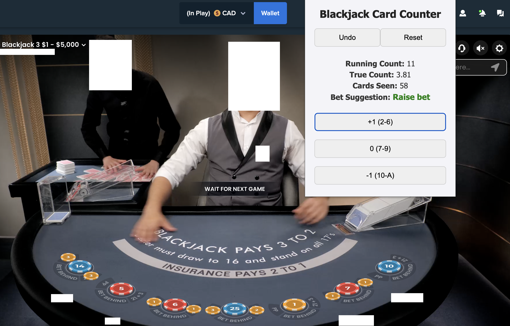

# Blackjack Card Counter (Chrome Extension)

A simple and user-friendly Chrome extension that helps Blackjack players keep track of the running count, true count, and number of cards seen. It provides basic betting suggestions based on common card counting methods and the number of decks remaining.

**It can be downloaded on Google Chrome with this link:
https://chromewebstore.google.com/detail/ilaadegjcjppggbmmjfbiekccceljhpa**

## Features
- **Deck Setup**: Input the number of decks at the start
- **Card Value Buttons**: Add cards by count category (2–6, 7–9, 10–A)
- **Live Tracking**: Displays running count, true count (adjusted for decks remaining), number of cards seen
- **Bet Suggestions**: Basic advice based on true count range
- **Undo & Reset**: Remove last entry or restart session
- **Session Persistence**: Remembers progress using local storage

 

